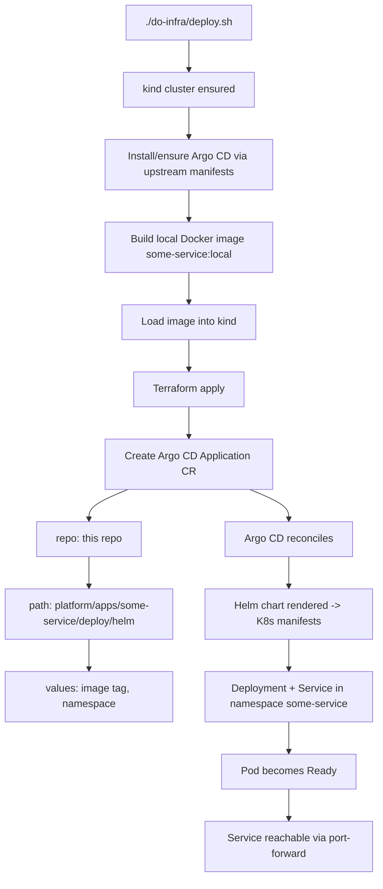
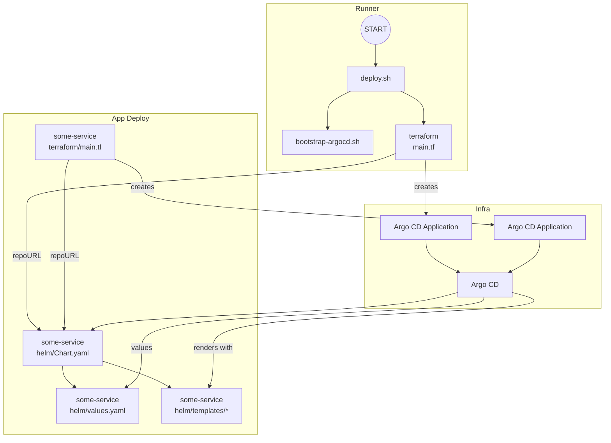

# do-deploy-example

Small example showing a GitOps-friendly deployment pattern using kind, Argo CD, Terraform, and Helm.

This repo contains:
- A minimal NestJS hello-world service at platform/apps/some-service.
- Dockerfile to containerize the service.
- Helm + Terraform configs to deploy the service (platform/apps/some-service/deploy).
- do-infra for spinning up a local kind cluster with Argo CD (installed via upstream manifest) and deploying the app via Argo CD Application.

Quick local cluster with kind + Argo CD + some-service (one command):
- From repo root:
  REPO_URL=https://github.com/your-org/do-deploy-example.git ./do-infra/deploy.sh

Then verify:
- kubectl -n some-service get pods,svc
- kubectl -n some-service port-forward svc/some-service 3000:3000
- Open http://localhost:3000 to see: Hello, World!

## Architectural overview
- Local cluster: kind provides an ephemeral Kubernetes cluster for development.
- GitOps engine: Argo CD (installed via upstream manifests) reconciles desired state from this repo.
- App packaging: some-service is packaged as a minimal Helm chart in-platform repo paths.
- Orchestration as code: Terraform defines an Argo CD Application that points to the Helm chart in this repository and (optionally) prepares the namespace.
- Image flow: a local Docker image can be built and loaded into kind; the Helm values reference that image tag.
- End-to-end flow: deploy.sh creates/ensures the kind cluster, installs Argo CD, builds/loads the image, then applies Terraform to register the app with Argo CD. Argo CD then continuously syncs the app into the cluster.

### Repository layout (directory tree)
```
.
├─ do-infra/
│  ├─ deploy.sh
│  ├─ bootstrap-argocd.sh
│  └─ terraform/
│     ├─ main.tf
│     └─ outputs.tf
├─ platform/
│  └─ apps/
│     └─ some-service/
│        ├─ Dockerfile
│        ├─ src/
│        └─ deploy/
│           ├─ helm/
│           │  ├─ Chart.yaml
│           │  ├─ values.yaml
│           │  └─ templates/
│           │     └─ hooks-presync-job.yaml 
│           └─ terraform/
│              └─ main.tf
├─ README.md
└─ .gitignore
```
**Notes**
* `do-infra` contains the container-level configuration and deployment orchestration scripts.
* `platform` contains the application-level configuration and migration scripts, alongside the actual application code.
  * `deploy/terraform` is the infrastructure needed for the application.
  * `deploy/helm` is the application itself, with configuration.
  * `deploy/help/templates` is the migration scripts.

### Deployment orchestration (flow chart)
This shows the execution flow of a full deployment.


### Configuration reference (block diagram)
This shows how the configuration files reference each other.



